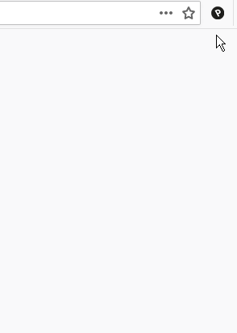
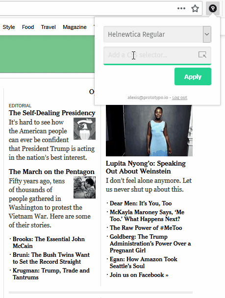

The Prototypo Web Preview is a browser extension that enables you to see your fonts made inside Prototypo on any webpage you like. It can be used by both designers and web developers that want to see how their fonts looks like on a real world web project.

Any changes made in Prototypo will automatically be applied on the webpage.

## Installing the Prototypo Web Preview extension

First, you need to install the Prototypo Web Preview extension. For now, this extension is only available for [Google Chrome](https://chrome.google.com/webstore/detail/prototypo-web-preview/jglgljnhjnblboeonagfmfgglfdeakkf) and [Mozilla Firefox](https://addons.mozilla.org/fr/firefox/addon/prototypo-web-preview/).

## Login into the extension

Click on the Prototypo icon, a panel opens. Enter the email and the password you use on Prototypo.

## Using the extension

The extension is now ready to be used. Your projects are available on the select list ready to be used on webpages.

### Using the automatic selector

Right under the select list, you have an icon to select an element on the page. Click on it and move your mouse around the page to see elements being highlighted. Once you have targeted the element, click to apply and wait for the font to load.

### Using a custom CSS selector

If you want to select more elements at a time, you can use the power of CSS selectors to target multiple elements at the same time. If you don't know HTML and CSS, you can learn the basics on the excellent [MDN](https://developer.mozilla.org/en-US/docs/Learn/CSS/Introduction_to_CSS/Selectors) and [this CSS Tricks article](https://css-tricks.com/how-css-selectors-work/).

Now, you just have to enter your selector in the field and you will see all the matching elements highlighted on the page. Click apply to inject the selected font on the page.
