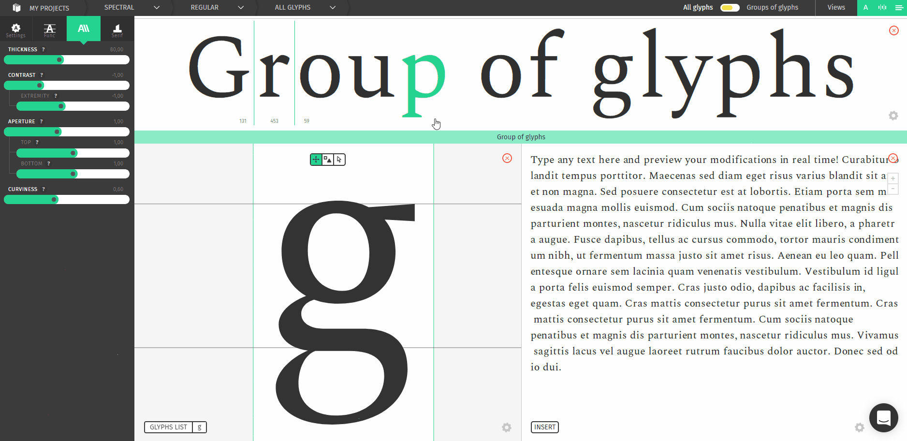
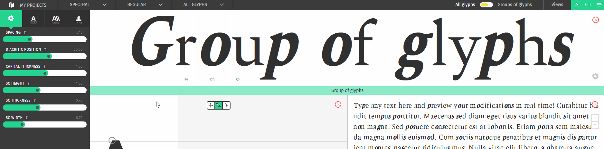
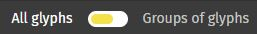
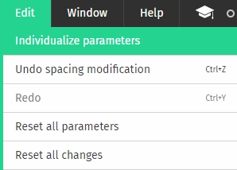
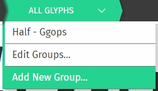
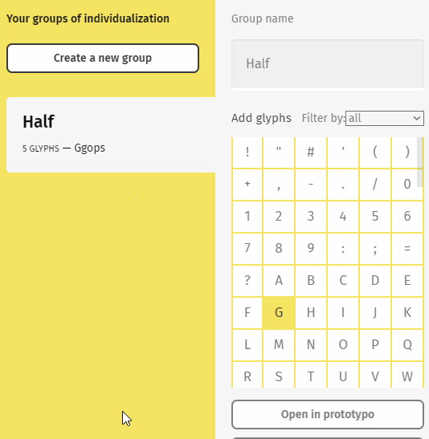
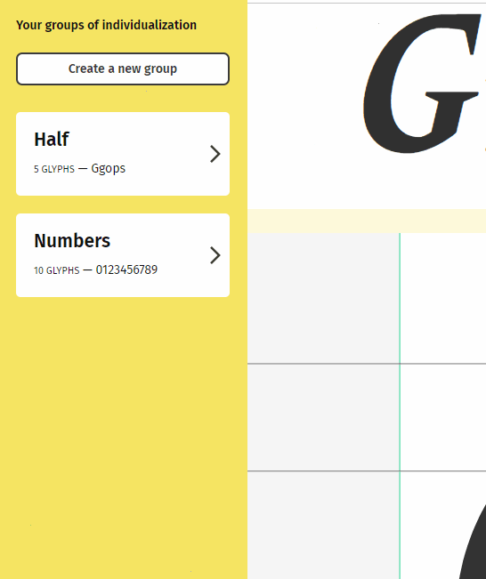
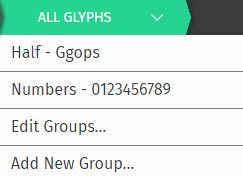
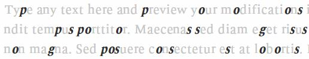

## About the feature

Individualization groups are awesome if you want to tweak the shape of a specific set of glyphs.
You can use this feature to make corrections, to get some diversity in your project or to make one character stand out, possibilities are endless! 

In this course you will get to know this feature, how to use it and to combine it with the regular view to make outstanding projects.

## How to use it

The sliders can work in two modes: the regular one, symbolized by a green UI, and the individualization mode with a yellow layout.

### Getting into the individualization panel

There are three way to switch modes :

You can click on this switch to quickly jump from one mode to another.

You can also achieve the same result by going in the Edit > Individualize parameters menu option.

Last but not least, the last item of the breadcrumbs allows you to quickly jump between your individualization groups, edit them or create a new one.

### Managing groups

Once you enter the individualization mode, you will be prompted to create a group.
A group is a set of glyphs that will be modified together.

#### Create a group
To create a group, select the glyphs that you want to put into by clicking on them, then name the group and click on **save change**. The new group will be put in the group list.

#### Grey letters in your glyphs list
> A glyph can only be on one individualization group at a time

If a letter in your list is grey, it means that this letter is already used in another group. If you want to use it in your new group you will have to remove it from the previous group beforehands.

#### Filter the glyphset
Just like the glyphs list, you can filter the glyphset displayed to find the needed glyphs faster.

#### Edit your groups

In the individualization mode, you have access to your group list. 
You can rename, edit the glyphs in a group or remove the group easily.

### Working in individualization mode
Once you have created your group, or selected an existing group and clicked on "open in Prototypo", you will be put in a yellow version of the app, which means that you are in the individualization mode.

#### Switching groups
You can see your active group on the last item of the breadcrumbs: 

There, you can see that I am on my *numbers* individualization group.
If you click on this item, you can switch between your groups, go back to the normal mode by clicking on **all glyphs** and add a new group.

#### The text view
You might also notice that the *text view* have changed a bit, like this:

The black letters are the letters inside your actual individualization group. The grey ones are the other letters.

#### Using the sliders 

There is two new buttons in the slider view: 

These buttons can enable two modes for the sliders: **relative** and **absolute**

*  When this icon is active, it means that the slider is in **relative** mode. Every change made to this slider will be relative to the slider value for the overall font (that is set in green mode). This is specially useful to make corrections to some glyphs.
*  I you do not get the expected result with the relative mode or just want an uncontrolled slider, the **absolute** mode might be for you. The changes made to this slider will be applied independently from the overall value. This can be usefull if your overall slider is set to Zero, if you want more contrast or just want to experiment with your font design.

### We hope you found everything you needed to know about the individualization in this tutorial!