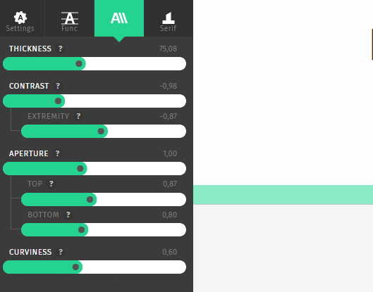
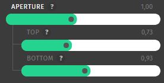

Working with the sliders is the first step in Prototypo's workflow. This tool allows you to quickly change the overall shape of the font and get to something close to your idea faster. 
Each slider has a label that show the parameter that will be updated, and the current value of the parameter.
It can be moved from left to right by clicking and dragging your mouse on the black circle.

## The tabs

Above the slider view are four tabs : **Settings**, **Func**, **Style**, **Serifs**.

Each tabs represents a step on a classic design process. Usually, you should work from left to right: from the sliders on the first tab, on to the second tab and so forth, with some going back and forth to make some changes, of course.

## The red zone

When pushing the sliders to their limit you might have noticed that the slider background went red, like this:

Don't worry, it's not a problem. We're just telling you that you are entering the *experimental* zone. It's still perfectly allowed to go onto this sone, but you might have some issues with legibility or small font-size display.
However, you can have very nice results and a lot of artistic possibilities by experimenting in these zones. 

### Setting a manual value for a slider

If you need to try a specific value for a parameter, or even go further than the sliders allows you to go, click on the slider value.
There, you can input any value you want and it will be set.

## More infos

If you want to get the default value for a slider, just hover a slider and click on the reset button. The parameter will be reset.

Not sure about the effect of a slider ? Don't worry. Click on the **?** icon and a tooltip will slide open, showing what's the effect on a letter. You can circle through the slider by clicking on the arrow below it, and close it if you click on the close icon.

Sometimes, there are some sliders that are linked to another one, like this: 
.

This means that this slider is a child of his parent, usually meaning that it can control a part of a parent slider. Like on the *Aperture* slider, where you can control the overall aperture, and also the top and the bottom aperture independly.

### That's the end of the Sliders overview. Thanks for reading!