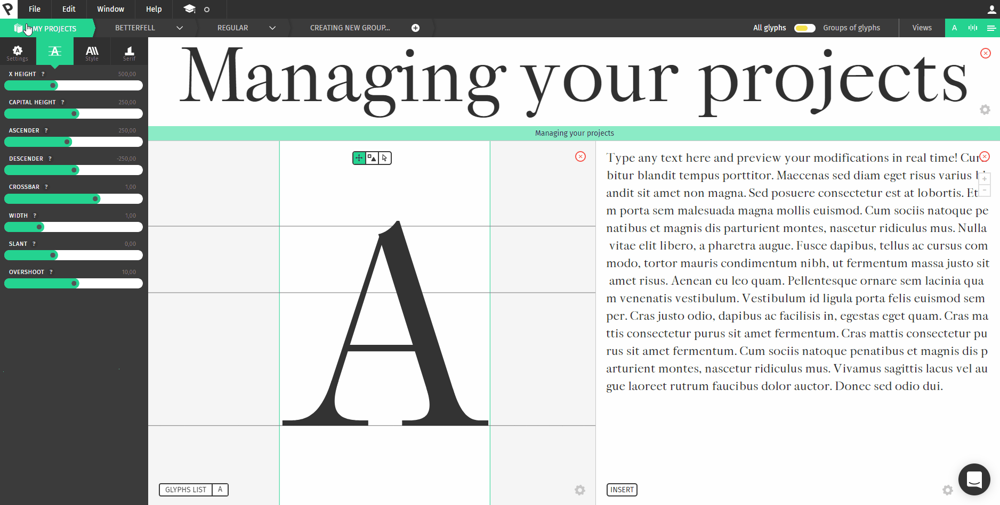
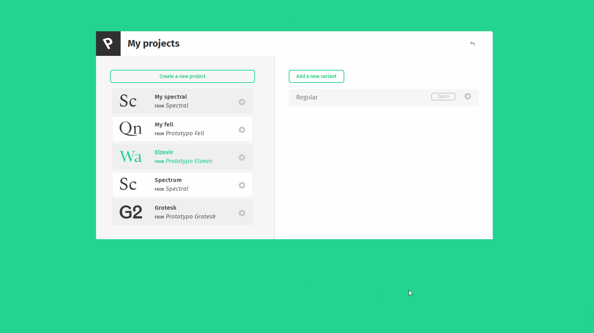
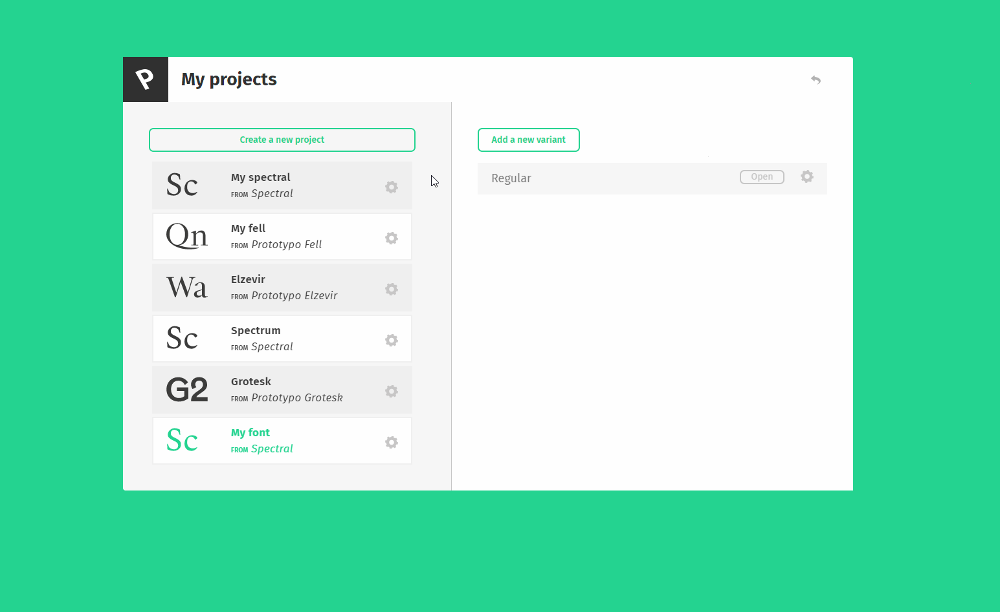
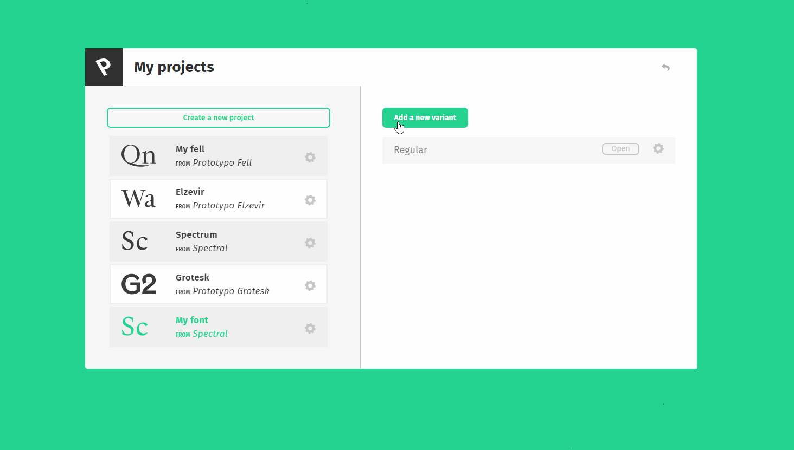
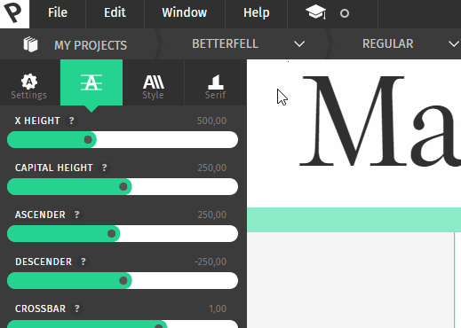

## The basics

Managing your projects in Prototypo is important. Being able to review your previous work, enhance it or add new project is a powerful asset when it comes to such a thing as complex as type design.
You can create several projects, called **families**. For each family, you can create as many **variants** as you want. You will open those variants in Prototypo and work with them.

## Creating a new project

To create a new project, go to the project page as explained above, then click on ***create a new projet***.
Then, chose the template that matches your needs, name it and click on ***create family***. You're good to go! A regular variant has been created for your family, you just have to open it to start editing.

## Family Actions

By right-clicking a family or clicking on the wheel icon, you can either:
* **Rename** a family
* **Delete** it

## Variants Actions

The variant panel on the right allows you to create a new variant by clicking on the ***add a new variant*** button.
There, you can name your variant by typing on the input or choose a predefined one, like an "Italic" version for instance. The action will create the variant and it will also change its design matching, in this case, with the Italic version. 

Same as the family view, by right clicking or clicking on the wheel icon, you can access the variant actions. There, you can:
* Change the **Variant's name**.
* **Duplicate** the Variant — which is really helpful when you are experimenting on a font and you still want to be able to easily go back to the previous stage of your project, or if you want to copy some modifications onto a new variant.
* **Delete** it.

To **open** a variant, just click on the open button or double-click on the variant you want to open.

## Tips and tricks

* You can double-click on a variant to open it, and right-click on a family or a variant to open its actions.
* You can switch between projects or variants, and even create new ones using the breadcrumbs menu in the top-bar, as shown below.

### And that concludes our tutorial about project management. Thanks for reading!
