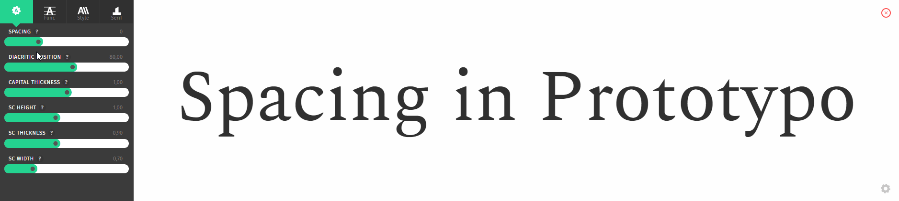
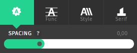
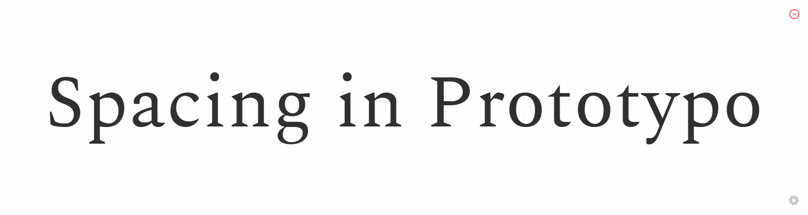
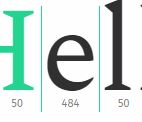

In typography, the spacing of a font has a huge impact on its readability; it refers to the amount of space between the characters, and it’s as important as the letter itself.
Good letter shapes without the proper spacing will not be good to use.
A nice spacing optimizes legibility, creating an even text "color" or visual texture between all characters, bringing rhythm to the reading.
Think about a drawing in black and white. There needs to be white to let the black shine. The same can be applied for a logo or a typeface.

## Adjusting the global spacing from the sliders

There is a slider in the **settings** menu called **spacing**.

Changing its value will change the overall spacing of your project.

> You can also adjust the spacing for a group of letter by creating an individualisation group.

## Fine-tuning the spacing in the word view

If you need to make some adjustment on your spacing between some letters, you can change it in the **word view**.
Select a glyph by clicking on it, you will see two green bars, and at the bottom the current spacing value.

Drag them to the left or the right to adjust the spacing value for this letter.

## Upcoming features

We are working on several features to enhance the spacing modifications:

* Change the spacing value by putting a number directly into the wordview when the glyph is selected
* Dragging the green bars in the glyph view, just like how it is done on the word view.
* Create a summary spacing table with all the spacing values for the project glypshet.

### That's how you manage spacing in Prototypo. Thanks for reading!
