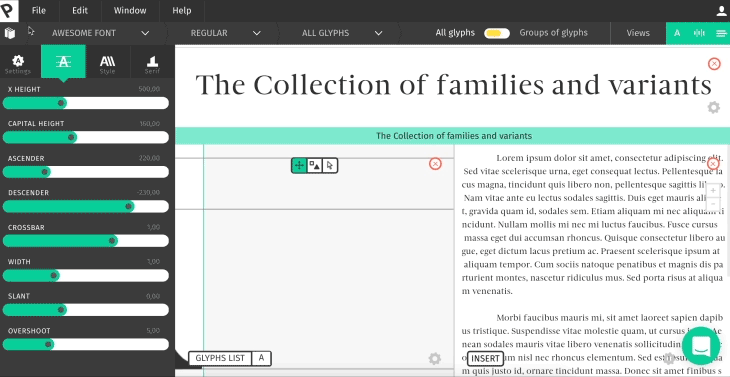
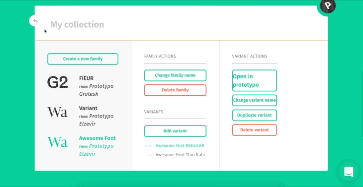
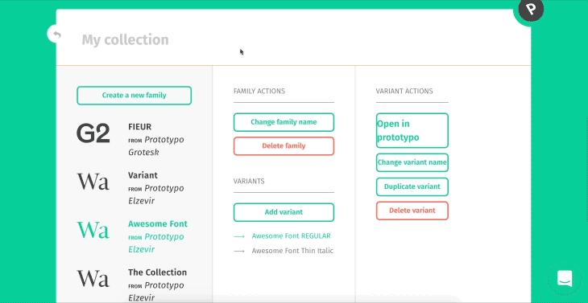
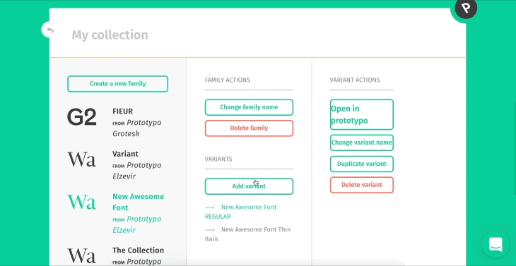
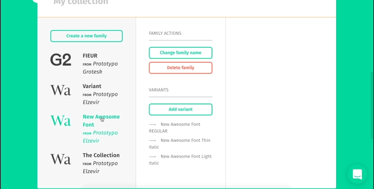

## What is it?

The Collection of Families and Variants is a name Prototypo gives to an area where you can access your different projects and modify them. In this tutorial we will see how to access it and how it works. Being able to review your previous work, enhance it or add new project is a powerful asset when it comes to such a thing as complex as type design.

This window pannel is divided in three sections:

### The Collection

As previously stated, the Collection is an area in Prototypo where you can access your previous projects. You can create new typeface families by clicking the "Create new family" button. This will pop up a window allowing you to choose a family style (Elzevir, Grotesk or Fell). 

### Family Actions

In the "Family Actions" area, next to the Collection one, you can Change the family name of your typeface, Delete it and Create and/or access Variants to your font. You can either create a new variant of your own and choosing a name for it or select one in the pre-existing list given by Prototypo.

### Variants Actions

The Variant Actions allows you to open your Variant in Prototypo, change the Variant's name, Duplicate the Variant — which is really helpful when you are experimenting on a font and you still want to be able to easily go back to the previous stage of your project — or Delete it.

What's really neat about the Variants pannel is that if you can choose to add an "Italic" version to your already existing font. Not only will it create this Variant, it will also change its design to match an actual Italic version. By the way, some of these informations are reminded in the "Breadcrumbs & Top bar" lesson.

### And that concludes our tutorial about the Collection of families and Variants! Congratulations!