In Prototypo, there are three main views:
* The **text** view
* The **word** view
* the **glyph** view

Each view has its purpose, and it's good to know how to manage and use them in order to feel comfortable while using the app.

## Display and resize the views
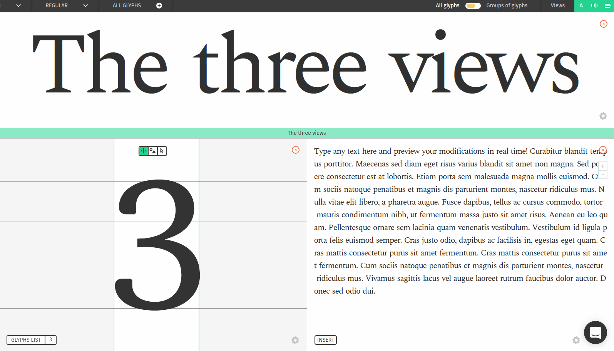

First off, **displaying** the views. On the top-right, there are three icons:   that can be either green or white. Green means that the view is opened, and white that the view is hidden. You click on an icon to toggle the view display.
You can also click on the close  icon to hide the view.

Next, **resizing** the views. By default, the views are equally split on the interface but you might want to give more importance to a specific view.
To do that, click and drag on the border between each view to resize them.

> There might be an issue where the resize bars are not there and you can't resize the view.
> Just move your cursor to the very top of the word view or the very left of the glyph view and drag them back where they belong.
> We are aware of the issue and will fix this soon.

## The text view
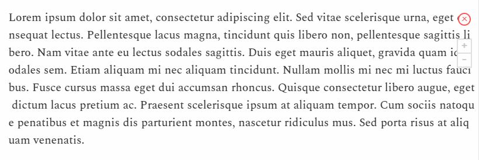

The text view role is to display a large block of text to get an overall view of your font.
With this view, you can have a good realistic impression of your typeface balance and color and see the impact of your modification on a large scale.

You can adjust the **zoom** factor by clicking on the icons on the top-left: 

By clicking on the wheel icon or right-clicking anywhere in the text view, you can open the options menu and have more testing options like **inverted view** and **white on black** display.

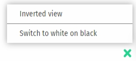

On the bottom-right, there is a **insert** button. Click on it to insert some sample text like *the quick brown fox*, the *Latin alphabet* or a *lorem ipsum*.
You can also type anything you want inside the view to preview your own text.

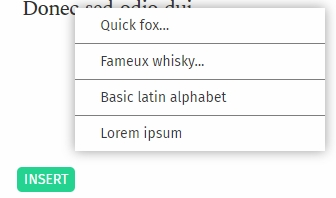

## The word view

Working on a full text can be all you need, but often you will need more. If you want to work on a logo or fine-tune your project, the word view is a good thing to work with. With the word view, you can display any text that you want on a bigger scale than the text-view and work on the details.

To change the text displayed, click on the green bar below the Word view, and type the text that you want to be displayed.

One feature of the word view is to work on the spacing between letters. To do that, click on a glyph inside the word view and drag the green bars.
(Learn more about spacing in [our spacing course](/academy/course/Spacing-handling-in-Prototypo).

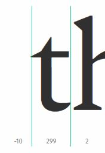

Just like in the text view, you can right-click anywhere or click on the wheel icon to display the word view menu. There, you can also invert the view or switch on the white on black mode.

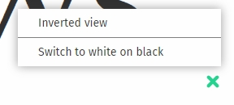

One last trick with the word view: you can double-click a glyph in the word view to select it in the glyph view.

## The glyph view

Last layer of detail: the glyph view. This is the highest level of details that you can achieve in Prototypo, and also the hardest view to master.
This view is mainly used to do some fine-tuning or corrections to a specific glyph, or make hard modifications which go way below the range of the sliders.

> Sometimes there is no glyphs displayed in the glyph view, especially when changing views or loading the app.
> To get the glyph back, double-click on the glyph view or right click / click on the wheel icon then click on *reset view*.
> We are working on a fix to prevent this from happening.
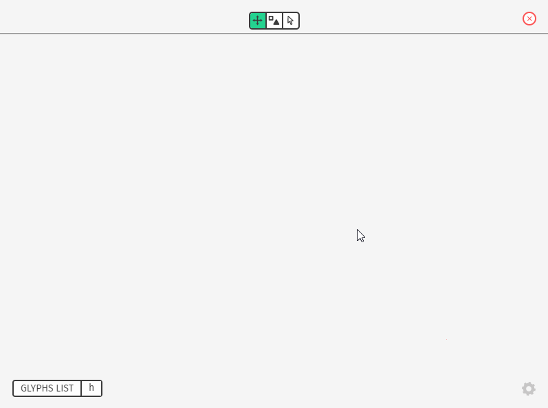

There are several ways to change the glyph displayed:
* Double click on a letter in the word view, as said above.
* Click on **glyphs list** then select the glyph (see [our glyphs list course](/academy/course/Using-the-glyphs-list)).
* Click on the **glyph** button next to the **glyphs list** button which highlights it, then press the character that you want to be displayed on your keyboard.
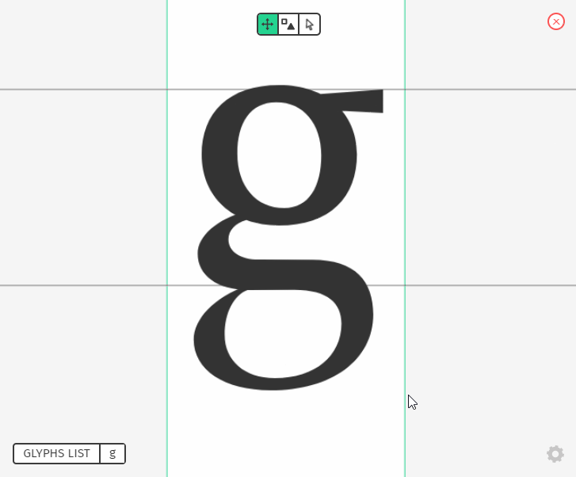

In this view, you can scroll to zoom. Press the **Z** key anytime to temporarily go back to the initial zoom.

At the top of the view, there is a menu bar. Each symbol represents a feature inside the glyph view.

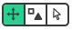 the first menu is the **move** feature. In this feature, you can move your glyph inside the view by dragging it with your mouse. You can reset the view by double-clicking on the glyph view or right clicking / clicking on the wheel icon then click on *reset view*.
You can temporarily go back to this view while keeping the **space** key pressed.

 the second one is the components feature. It allows you to quickly add or remove components on this glyph. See [our components course](/academy/course/Using-Components) for more details on this feature.

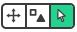 the last menu item is the manual editing feature. In there, you have access to all the nodes composing the glyph. You can click on a node to show the controls.
Drag the node around to change its position, or drag the controls to get a more subtle change.

You can reset the manual changes anytime by clicking on **Reset glyph**. You can also reset one node by clicking on the green arrow displayed if the node is selected, or press **ctrl + z** to undo one change.

A course which goes more in depth about the manual editing feature is coming, stay tuned!

And as always, you can right-click anywhere or click on the wheel icon to display the glyph view menu. There, you can display only the outline of the glyph, show the node coordinates if you are on the manual editing feature, or reset the glyph position.

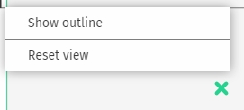

### Thanks for reading this course! I hope we have answered some questions that you had. See you on the next one!
