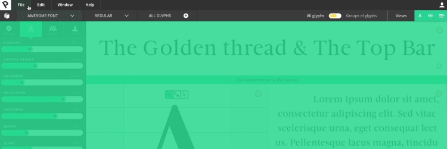
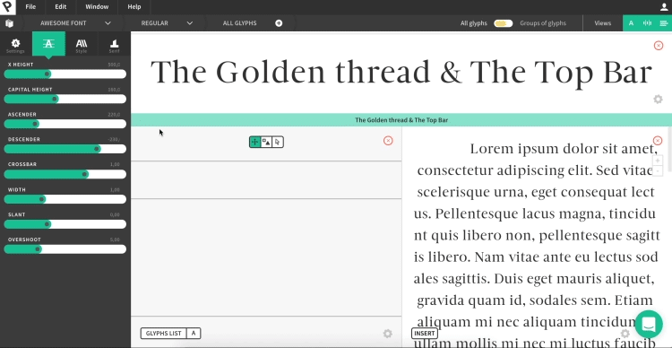
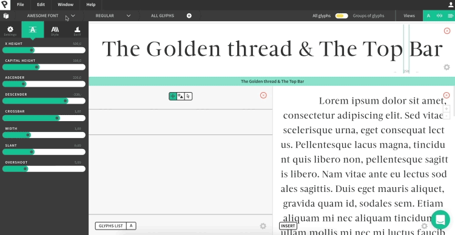
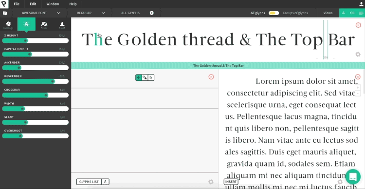
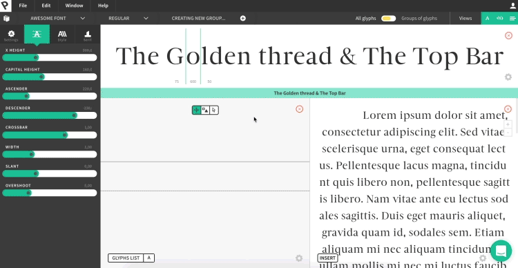
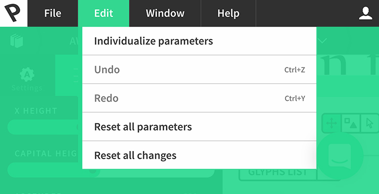
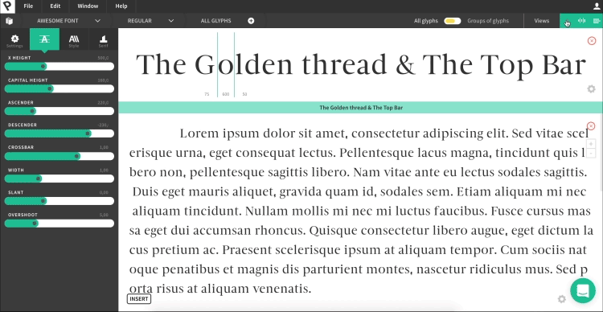

## Intro

> The Breadcrumbs and the Top bar are essential tools for anyone using Prototypo. They are linked to eachother and give you access to your projects or to the typeface you're working on from different angles. In this tutorial we will cover what those tools are and how to use them.

## The Breadcrumbs

### The Breadcrumbs is an area in which you will have access to everything you need to navigate between your projects and the Typeface you're working on.

First, let's cover what is inside the Breadcrumbs in Prototypo:

 

The Collection button leads you to your typeface family collection. It contains everything you've already created using Prototypo. When accessing it you can also create a new family, change family names, add variants or delete family. You can use this icon to see everything you've already worked on and apply change to the whole "editorial" part of the typeface family: names, styles.

To get back to  the application, simply click on the back button 

### Families, variants and groups

The second part of the breadcrumbs is divided into three parts. The Families, the variants and the glyph groups.

The Family name of the typeface you're working on: a simple way to both let you know which project you're in and switch from one project to the other. You can use it to see which project you're working on and switch from one Typeface Family to the other. A really handy tool when you're working on multiple projects.

Variants of the Typeface you're working on: you can click on that button to add a new variant to the typeface family. You can use it to add a new variant or easily switch from one variant (typeface style) to the other. When you click on "Add new variant", a pop-up window will show, you can add a new variant name or choose a variant from the list Prototypo offers you and that Variant's style will be added to your existing typeface along with its specific design details. For example, if you choose to add a Thin Italic version to your existing font, the new variant will be a thinner and slanted.

All Glyphs button / All glyph slider: those allow you to switch between the All Glyphs mode and the Group of Glyph mode.
You can use those to create certain groups of letters which you can modify independently from the rest of the font. Glyph groups are a powerful tool that lets you create highly customized and precise typeface. You can learn more about them in the own course.

 

### Now that we have covered what's the Golden Thread, we can focus on the other part of this tutorial: the Top Bar.

## The Top Bar

### The Top Bar is your usual software button area where you can manage several things linked both to you, the user, and to your projects.
 
- The File button 

- Edit button: Individualize parameters access you to the "Group of Glyph" area we have already covered. Undo/Redo (ctrl+Z / ctrl+Y). Reset All Parameters to / Reset All changes: both to be used if you want to revert back to the original template of the typeface you're working on.

- Window is a quick way to access the different Views available in Prototypo (and its linked to the Views Iconic bar).

- Help Button, to chat with Prototypo, access the FAQ, Restart the Tutorials, access the Academy.

- Your account button accesses you to your Prototypo account dashboard containing every infos you need to manage your subscription and billing, your profile (adress and infos about yourself), your billing history, etc. 

- The Views bar: Character View allows you to see what you're doing on a specific letter and give you access to tools to modify said letters / Sentence View allows you to see the glyph modification changes on a sentence and also give you access to changing the sidebar of a glyph / Text view allows you to see  the typeface modification when used in a text block (in different sizes). 

## And that concludes our tutorial about the Golden Thread and the Top Bar ! Congratulations !

