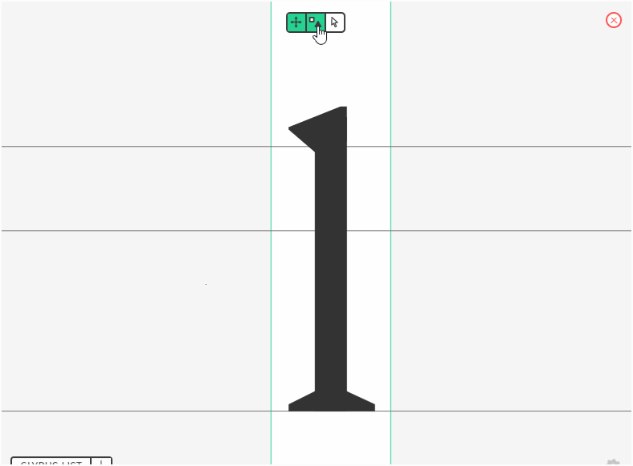
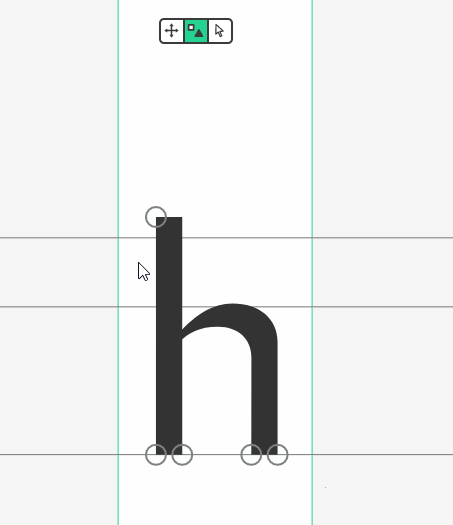
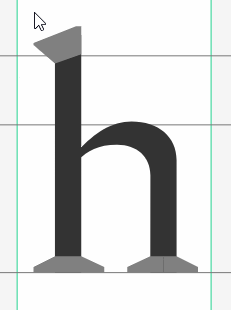
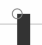

## Components?

>You found a template that fits your needs but it's not quite right?
>How about the new Spectral template, but without serifs? Or maybe only the serifs on the left?
>The components might be the right tool for you!

The components are modular blocks that can be applied to a glyph like serifs, dot or accent style.
By using the components, you can quickly add or remove shapes in a glyph, allowing you to quickly change the overall design of a template.

### Where to find those

You can open the components view by clicking on the **square and triangle icon** on the **glyph view** (usually in the bottom-left corner of your screen).

### Using them

Once you open the component view, you may or may not see gray zones in some parts of the glyph.
**Not all glyphs can have components. However, we are regularly adding new ones for various glyphs.**
If a glyph can have components, there are two possible cases:

 This glyph have a component applied at this position

 This glyph can have a component applied at this position but none is currently set.

To apply or change a component, click on the component icon (the circle or the gray shape), and click on the component you want to apply on the menu that just opened.

You can manually edit a component by selecting and dragging its nodes just like you would do with the glyph. You can also apply the changes to the similar components.

### That's the end of our quick tutorial about components. I hope you will find this feature useful to your needs!
