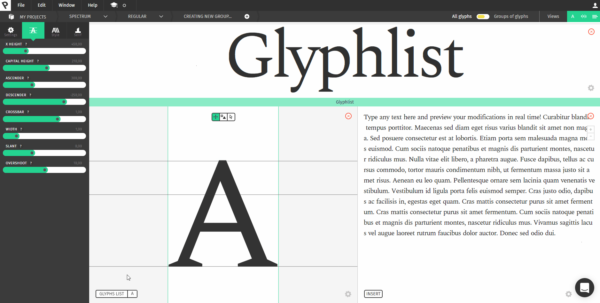
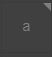
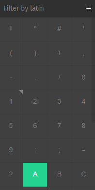
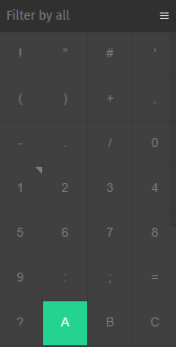
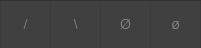
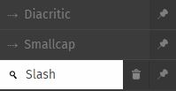

## Open and close the glyphs list

To open the glyphs list, click on the **Glyphs list** button on the **glyph view**.
The glyphs list will slide open on the right part of your screen.
To close it, just click again on the **Glyphs list** button.

## Select a glyph and see its information
The glyphs list is a scrollable list of all the glyphs available in the template. From there, you can **click on a glyph** select it in the glyph view in order to apply component, to manually edit it or just to have a bigger view of it and make any kind of modifications.
Some glyphs in the lists have **corners**. At this time, there are two types of corner available:

 This icon means that this glyph has components. (See [our component course](/academy/course/Using-Components) to get more details about this feature).

 This icon means that this glyph has been edited using the **Manual edition** feature.

## Filter and search glyphs

If you need to work on a specific glyphset, you might want to reduce the number of glyphs displayed. In order to do that, there are two options: **filtering** or **searching**.

### Filtering a glyph

By clicking on **filter by...** the filter list opens. You can click on a filter to filter the glyphs list (only small caps, only diacritics, only Latin...) and click on the **close** icon to close the filter panel.

#### Pin a filter

If you click on the **pin icon** on a filter, this filter will be visible even if the filter panel is closed. Pretty handy if you have to switch between filters!

### Search for one or more glyphs
On the bottom of the glyphs list, there is a search input.  You can type there the name of the glyph or something that you want to look for and it will display the results just like a filter.

For example, you might want to look for *small* letters, *dash* characters, *dot* or *dotted* letters, or *slash*.

Here are the results for *slash* : 

#### Pin a search

If you want to save a search and use it like a filter, you can click on the green pin icon next to the search box and it will save your search as a filter that you can pin just like those.

 
### Here you go, an overview of the glyph list!
